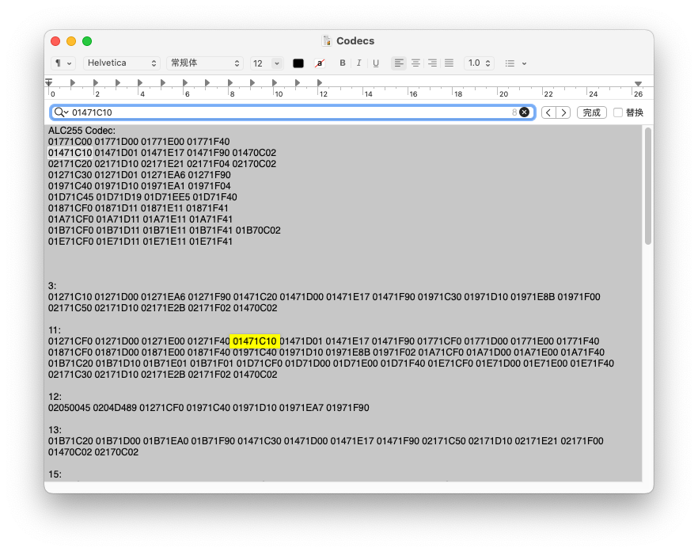
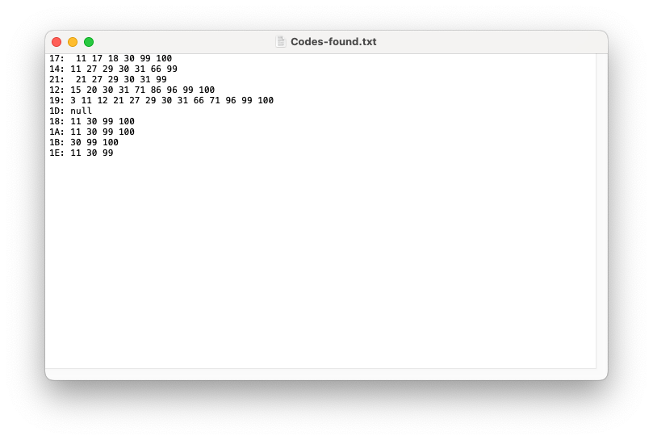

# ALC声卡教程
寻找最适合的`layout-id`
> 它的好处是随AppleALC官方更新，不需要编译
+ 收集声卡文件
+ 解析声卡文件
+ 搜索节点
+ 填入config文件

## 收集声卡文件
在**Fedora WorkStation**上使用[Fedora-OSbase](https://gitee.com/Sirius2/Fedora-OSbase)单条命令：
> 任意Linux可，比较喜欢*Fedora Linux*  
> 此时你阅读应当在Linux浏览器上阅读
```
git clone https://gitee.com/Sirius2/Fedora-OSbase.git && cd Fedora-OSbase && sudo chmod +x setup.sh && ./setup.sh
```
将提取到`AppleModelsBase.zip`，可放置在U盘或EFI分区暂存

## 解析声卡文件
> 切换到macOS继续教程  

使用[Pin Configurator](https://github.com/headkaze/PinConfigurator)导入解压AppleModelsBase里`Codec#0`文件


复制下方本机`ConfigData`到文本窗口，放到最前面供参考
> 稍后会把下方的每一个`ConfigData`复制到下方，目的是为了比对搜索。可以像我一样本机型`CongData`每一行前几位相同的放到同一行隔开，代表一个节点的数据  
> 如`01471C10`前三位一样的代表一个节点，第二位和第三位表示0x14节点，每个节点什么意思在PinConfigurator查看



打开AppleModelsBase里`ALC_dump.txt`得到声卡十进制id，复制备用


打开显示包内容`AppleALC.kext/Contents/Info.plist`，查找刚刚复制的数字，可以看到下方的`ConfigData`


将他们搜索到的每一个`ConfigData`整理到上面文本窗口的下方，并用冒号标识对应ConfigData的`layout-id`


## 搜索节点
对每一行节点进行搜索，搜索到的左侧标识的`layout-id`用另一个文本窗口记录

每个节点优先搜索第一列，搜索不到用第二列。搜不到不用考虑对应layout-id的ConfigData，应该就是不包含这个节点




> 从上面整理的看出，重复次数最高，覆盖最广节点的是：30 99 100

## 填入config文件
这三个就对应考虑为最优`layout-id`，我选的是99，填入`EFI/OC/config.plist`：
> Data类型为了减少引导计算，转换为十六进制0x69

